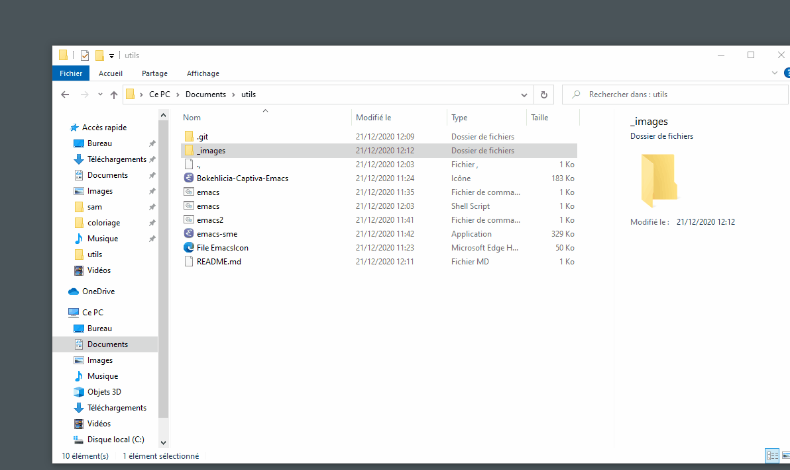

# Windows utils

## add some windows tools

### Emacs
Launch directly emacs from Windows with wsl2 and x410 window manager

#### Prerequisite

1. Install [X410](https://x410.dev/)
2. Configure wsl2 [Installation guide](https://docs.microsoft.com/fr-fr/windows/wsl/install-win10)

3. Copy the emacs.sh file in ~/bin/

#### How to launch

- Double click on emacs-sme.exe icon (you can also drag and drop to menu bar in order to have a direct link to emacs)

- Show it in action

